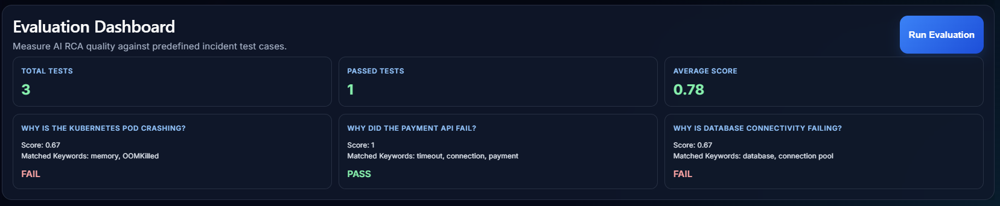

# AI Incident Copilot

AI Incident Copilot is an AI-powered incident intelligence platform that combines Retrieval-Augmented Generation (RAG), vector search, and local LLM inference to automate Root Cause Analysis (RCA) for production incidents.

The platform retrieves relevant operational evidence from logs and runbooks, synthesizes a structured diagnosis, recommends remediation steps, and evaluates RCA quality using benchmark incident scenarios.

## Key Capabilities

### Incident Intelligence

* Natural-language incident investigation
* AI-generated Root Cause Analysis (RCA)
* Confidence scoring
* Evidence-backed reasoning
* Actionable remediation recommendations
* Preventive action suggestions

### Retrieval-Augmented Generation (RAG)

* ChromaDB vector retrieval
* Log and runbook ingestion
* Retrieval observability
* Source attribution and evidence tracing
* Grounded AI responses

### Evaluation Framework

* Automated RCA benchmarking
* Pass/Fail incident evaluation
* Keyword-based relevance scoring
* Average score reporting
* Retrieval quality validation

### Knowledge Base Support

* Upload operational logs
* Upload runbooks
* Semantic document retrieval
* Context-aware incident investigation

## Architecture

```text
User Query
    │
    ▼
React Frontend
    │
    ▼
FastAPI Backend
    │
    ▼
ChromaDB Retrieval Layer
    │
    ▼
Retrieved Evidence
    │
    ▼
Ollama Local LLM
    │
    ▼
Structured RCA Report
```

## Technology Stack

| Layer           | Technologies           |
| --------------- | ---------------------- |
| Frontend        | React, Vite, Axios     |
| Backend         | FastAPI, Python        |
| AI              | Ollama                 |
| Vector Database | ChromaDB               |
| Retrieval       | RAG Pipeline           |
| Infrastructure  | Docker, Docker Compose |

## Example Incident Scenarios

### Kubernetes Failures

* CrashLoopBackOff
* OOMKilled containers
* Resource exhaustion

### Database Incidents

* Connection pool exhaustion
* Slow query detection
* Infrastructure bottlenecks

### Application Outages

* Payment API failures
* Service degradation
* Dependency failures

## Evaluation Dashboard

The platform includes an RCA evaluation framework that measures:

* Retrieval effectiveness
* Evidence grounding
* Incident diagnosis quality
* Keyword coverage
* Pass/Fail benchmark scoring

## Local Development

### Start Application

```bash
docker compose up --build
```

### Frontend

```text
http://localhost:5173
```

### Backend

```text
http://localhost:8000/docs
```

## API Endpoints

| Method | Endpoint               | Description               |
| ------ | ---------------------- | ------------------------- |
| POST   | /incident-intelligence | Generate RCA              |
| POST   | /upload                | Upload logs and runbooks  |
| GET    | /evaluate              | Run evaluation benchmarks |
| GET    | /health                | Service health check      |

## Screenshots

### Incident Intelligence Dashboard


### AI Root Cause Analysis


### Evaluation Dashboard



## Future Enhancements

* Hybrid retrieval (BM25 + vector search)
* Reranking pipelines
* Citation-aware generation
* Multi-agent incident workflows
* Incident timeline reconstruction
* Slack / Teams integrations
* Retrieval analytics and observability

```
```
