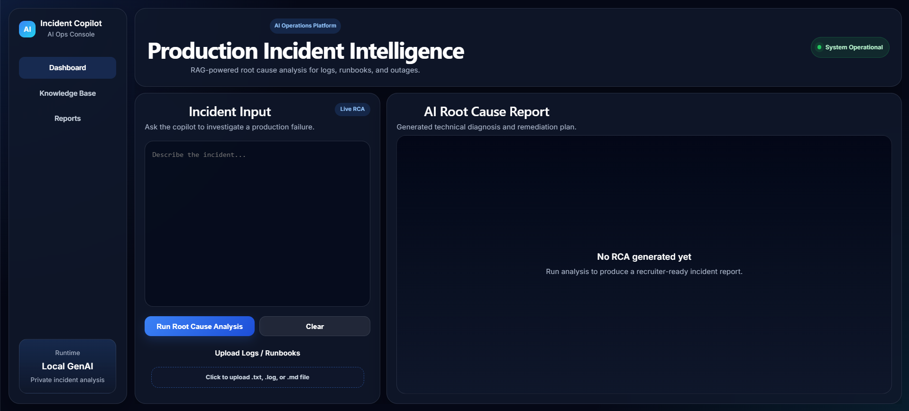
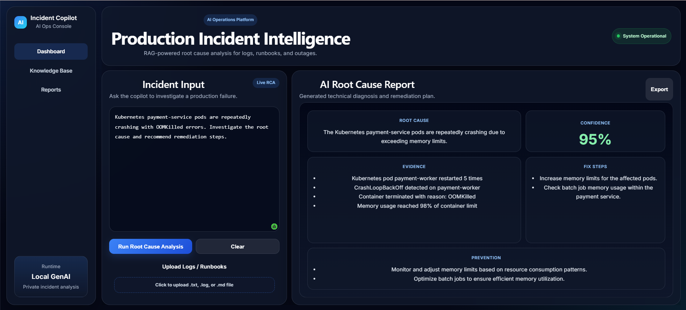
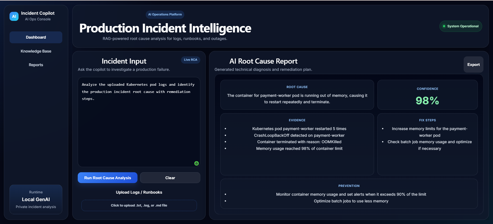

# AI Incident Copilot

AI-powered production incident intelligence platform for Root Cause Analysis (RCA) using FastAPI, React, RAG, Ollama, ChromaDB, and Docker.

---

## Features

* AI-powered Root Cause Analysis (RCA)
* Log and runbook upload support
* Retrieval-Augmented Generation (RAG)
* Local LLM inference using Ollama
* Structured AI incident reports
* Kubernetes incident analysis
* Dockerized deployment
* Production-style React dashboard

---

## Tech Stack

| Frontend | Backend | AI / RAG     | DevOps         |
| -------- | ------- | ------------ | -------------- |
| React    | FastAPI | Ollama       | Docker         |
| Vite     | Python  | ChromaDB     | Docker Compose |
| Axios    | Uvicorn | RAG Pipeline |                |

---

## Architecture

```text
User Input / Logs
        ↓
React Frontend
        ↓
FastAPI Backend
        ↓
ChromaDB Retrieval
        ↓
Ollama LLM
        ↓
AI RCA Report
```

---

## Screenshots

### Dashboard



### AI Root Cause Analysis



### Upload + Analysis Workflow



---

## Example Incident Scenarios

* Kubernetes CrashLoopBackOff incidents
* OOMKilled container failures
* Database connection pool exhaustion
* Payment API outage analysis
* Infrastructure log investigation

---

## Run Locally

```bash
docker compose up --build
```

Frontend:

```text
http://localhost:5173
```

Backend API:

```text
http://localhost:8000/docs
```

---

## API Endpoints

| Method | Endpoint   | Description          |
| ------ | ---------- | -------------------- |
| POST   | `/analyze` | Generate AI RCA      |
| POST   | `/upload`  | Upload logs/runbooks |
| GET    | `/health`  | Health check         |

---

## Author

Neha Parepalli
